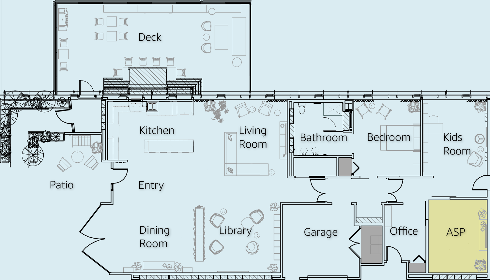

Alexa Smart Properties (ASP)
###########

Explore how ambient intelligence from Amazon can make your time away from home simpler. Learn how you can connect your Alexa account to the Echo Show 15 at your hotel, allowing you to listen to your personalized music in your hotel room when you say, “Alexa, play my music.” You can also use Alexa in your room to learn about hotel amenities and order room service. No matter where you are, see how you can get your work done, while feeling right at home.

While being taken care of, let Alexa make your stay more comfortable. Adjust the temperature to your liking with the ecobee Smart Thermostat and let some natural light in with smart shades. If you need a hand, the Echo Show 8 will alert the staff to provide urgent assistance.

|

|

.. include:: productdetails/!producttemplate.rst
.. include:: productdetails/!producttemplate.rst
