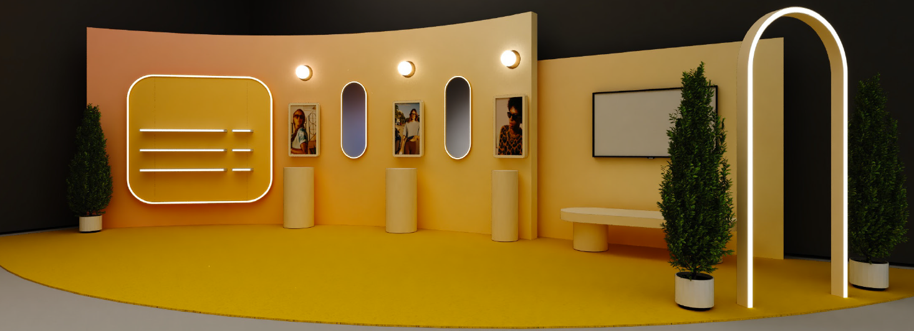

Dining Room
=====

Make every day better with Carrera Smart Glasses with Alexa. This all-new collaboration brings together the iconic stylings of the legendary Carrera brand with cutting-edge open-ear audio technology and Alexa. Carrera’s daring attitude has pioneered iconic designs since its inception in 1956. In this spirit, Carrera introduces a new era of smart eyewear, where its bold styling meets the innovation and intelligence of Alexa. Attention to detail and style is our signature, ensuring every piece is a work of art that reflects your individuality. Expertly crafted and designed. Our commitment to fashionable and functional styles ensures that you'll never have to compromise on either. Carrera Smart Glasses help you stay present—automatically detecting when you are not engaged in conversation to bring you important phone notifications and helping you get the most out of everyday activities.

Make every day better with Echo Frames. Echo Frames are smart audio glasses designed to help you manage everything without interruption — and look good while doing it. Speakers direct sound to your ears without covering them, while minimizing what others around you can hear. Improved bass and crystal-clear highs, deliver an enhanced and discreet audio listening experience. Experience the perfect combination of fashion and function with the 3rd generation of Echo Frames with improved audio and battery life, now available in new styles and colors. Designed to wear all day - lightweight and comfortable with IPX4 water and sweat resistance. Compatible with most prescription lenses.

|

|

Amazon Echo Frames
----

🟦 `Product Detail Page <https://www.amazon.com//dp/B09SVDB9P9>`_

**Details**

Do more without pulling out your phone. Echo Frames are designed to help you manage everything in style and without interruption. Ask Alexa to play the perfect playlist while on the go, make a call without stopping to look at your phone, hear the barista call out your coffee order without having to pause your Audible book. Even check to see if you locked the front door from a thousand miles away—and look good while doing it.

* ACCESS YOUR FAVORITE MUSIC AND CONTENT: Hit the streets and ask Alexa to play music, podcasts, or Audible books from some of your favorite streaming apps.
* HANDS-FREE COMMUNICATIONS: Keep in touch with open-ear audio calling, so you never have to pull out your phone.
* NEXT GENERATION OPEN-EAR AUDIO: Enjoy high-quality audio without the discomfort of headphones. Echo Frames speakers direct sound to your ears without covering them, while minimizing what others around you can hear. Now with improved bass and crystal-clear highs, Echo Frames deliver an even more enhanced and discreet audio listening experience than ever before.
* CONTROL YOUR SMART HOME FROM ANYWHERE: Do more with Alexa on your frames — check to see if you locked the front door, turn on/off lights, and set your thermostat when you're away from home.
* FASHION MEETS FUNCTION: Now available in new classic & fashion-forward styles made from handcrafted Mazzucchelli Italian acetate, German engineered spring hinges, and premium metal tone finishes designed to elevate your style.
* DESIGNED TO WEAR ALL DAY: Lightweight and comfortable with IPX4 water and sweat resistance. Compatible with most prescription lenses.
* DESIGNED TO PROTECT YOUR PRIVACY- Amazon is not in the business of selling your data or personal information to others. Microphones are designed to respond to the voice of the person wearing the frames and can be muted with the double-press of a button. You also have full control over your voice recordings and can view, hear, or delete them at any time.
* MORE BATTERY TO TAKE CHARGE OF YOUR DAY: Get up to 6 hours of continuous media playback or up to 14 hours of moderate usage. Moderate usage includes 2 hours 30 minutes of media playback, 1 hour of talk time, 20 Alexa interactions, and 90 incoming notifications, all intermittently throughout the day.
* DESIGNED FOR SUSTAINABILITY: This device's charging stand is made from 35% recycled materials. 95% of this device packaging is made of wood fiber-based materials from responsibly managed forests or recycled sources.
|
|
|

Carrera Smart Glasses with Alexa
-----

🟦 `Product Detail Page <https://www.amazon.com/dp/B0BL5SP2VD>`_

**Details**

The future of eyewear is now. Since its inception in 1956, Carrera’s daring attitude has pioneered iconic designs. It is in this spirit, we enter a new era with smart eyewear. An era where Carrera’s bold styling meets Alexa’s spirit of innovation and intelligence. Harness your potential and enrich life’s possibilities with Carrera Smart Glasses with Alexa.

* ACCESS YOUR FAVORITE MUSIC AND CONTENT: Hit the streets and ask Alexa to play music, podcasts, or Audible books from some of your favorite streaming apps.
* HANDS-FREE COMMUNICATIONS: Keep in touch with open-ear audio calling, so you never have to pull out your phone.
* NEXT GENERATION OPEN-EAR AUDIO: Enjoy audio without the discomfort of headphones. Carrera Smart Glasses speakers direct sound to your ears without covering them, while also minimizing what others around you can hear. Now with improved bass and crystal-clear highs, Carrera Smart Glasses deliver an even more enhanced and discreet audio listening experience than ever before.
* CONTROL YOUR SMART HOME FROM ANYWHERE: Do more with Alexa on your frames — check to see if you locked the front door, turn on/off lights, and set your thermostat when you're away from home.
* FASHION MEETS FUNCTION: These sunglasses transform and modernize our iconic silhouette for an elevated aesthetic. Handcrafted Mazzucchelli Italian acetate, precision engineered custom spring hinges and gold tone finishes, the full-rim navigator profile features the iconic Carrera ‘C’ positioned proudly front and center.
* PREMIUM LENSES: Comes with gray gradient lenses with UV400 protection that reduce glare in style. The glasses are IPX4 water and sweat resistant.
* DESIGNED TO PROTECT YOUR PRIVACY: Microphones are designed to respond to the voice of the person wearing the frames and can be muted with the double-press of a button. You also have full control over your voice recordings and can view, hear, or delete them at any time.
* MORE BATTERY TO TAKE CHARGE OF YOUR DAY: Get up to 6 hours of continuous media playback or up to 14 hours of moderate usage. Moderate usage includes 2 hours and 30 minutes of media playback, 1 hour of talk time, 20 Alexa interactions, and 90 incoming notifications all intermittently throughout the day.
* DESIGNED FOR SUSTAINABILITY: This device's charging stand is made from 35% recycled materials. 95% of this device packaging is made of wood fiber-based materials from responsibly managed forests or recycled sources.
