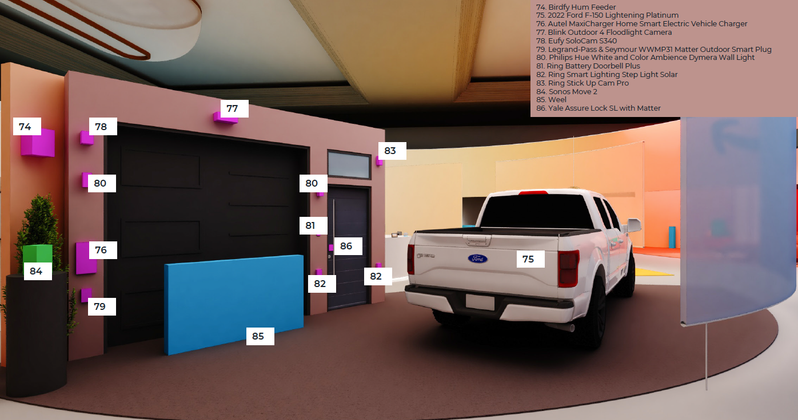

Garage
=====

Allow your evenings in your home to become safer. Ambient technologies help give you more peace of mind that comes from knowing that your loved ones are healthy and sound. You can check on your driveway and yard with the Blink Outdoor 4 Floodlight Camera, and make sure everything is safe and secure. Your Ford F-150 Lightning with Alexa built-in allows you to control our all your smart home devices with your voice, from the car. Park and plug your truck into the Autel MaxiCharger Smart EV Charger to manage, schedule, and optimize EV charging anytime to take advantage of off-peak electricity rates. When the day is done, lock up at night with the Yale Assure Lock SL with Matter from anywhere by adding the lock to Alexa to sleep safe and securely

|

|

Autel MaxiCharger Home Smart EV Charger
-----

🟦 `Product Detail Page <https://www.amazon.com/Autel-MaxiCharger-Electric-Bluetooth-Charging/dp/B0B8NFFYXT>`_

**Details**

Revolutionize your EV charging experience with the Autel MaxiCharger Home Smart Electric Vehicle Charger. This WiFi-enabled charger integrates seamlessly into your smart home, allowing for convenient monitoring and control through the Autel Explorer app. With a sleek and durable design, it delivers fast, reliable charging to keep your electric vehicle ready for the road. Experience the future of EV charging with advanced features, including scheduled charging, energy monitoring, and compatibility with Alexa for effortless voice control. Upgrade your home charging station with Autel MaxiCharger's cutting-edge technology.

* Trusted Brand: AUTEL has been leading the global automotive diagnostic industry since 2004. The latest AUTEL AC Home Level 2 EV Charger provides you with a safer, more intelligent, and fast charging experience.
* Level 2 EV Charging: The MaxiCharger Home is a 240 Volt electric vehicle (EV) charging station that can charge any EV or plug-in hybrid up to 9X faster than a Level 1 (120 Volt) regular outlet charger. The ev charger power output range of 6 amps up to 50 amps allows you to choose the charging speed that fits your lifestyle and home.
* Wide Compatibility: This MaxiCharger hardwired EV charger is a 240V-50 Amp Level 2 Charger compatible with all EV and Hybrid Plug-in vehicles. Bluetooth, Wi-Fi, Ethernet, CAN, RS485. A three-year limited warranty covers the unit.
* Smart and Convenient Mobile App: Manage your charging easily, intelligently, and insightfully. The advanced Autel Charge mobile app allows you to track, manage, schedule, and optimize smart EV charging anytime to take advantage of off-peak electricity rates.
* CSA Certified Safe and Reliable: Tested to UL safety standards by CSA, a Nationally Recognized Testing Laboratory (NRTL), the Autel MaxiCharger qualifies for local rebates and incentives. A NEMA 4X protection rating provides safe and reliable indoor and outdoor usage in any climate.
|
|
|

Birdfy Hum Feeder
-----

🟦 `Product Detail Page <https://www.birdfy.com/products/birdfy-hum-feeder>`_

**Details**

Discover the beauty of hummingbirds up close with Birdfy's hummingbird feeder camera. With 150+ species recognized, automatically capture and identify birds in your backyard. Receive real-time notifications through the Birdfy app, elevating your birdwatching experience with innovative bird feeder cameras. Access your feeder’s cameras through the Alexa app or on your Echo Show devices.

* More angles, more joy: With two 1080p high-resolution cameras, you'll gain a more comprehensive and detailed understanding of hummingbird behavior and appearance, enabling you to appreciate their elegance with unprecedented closeness.
* 150+ Species Recognition: Through extensive data training, our intelligent feeder accurately identifies the exact hummingbird species visiting your feeder. Coupled with the advantage of multiple camera angles, it ensures precise identification like never before.
* Ant Moat and Built-in Sensor Innovation: Our feeder prioritizes hummingbird well-being. It includes an ant moat system to prevent ant invasions and a built-in temperature sensor that reminds you to change the nectar for freshness.
* An Eco-friendly Way for Smart Birdwatching: Paired with a solar panel to use, this hummingbird feeder camera is powered by green energy, ensuring constant functionality. Let's go birdwatching in a green way！
|
|
|

Blink Outdoor 4 Floodlight Camera
-----

🟦 `Product Detail Page <https://www.amazon.com/All-New-Blink-Outdoor-Floodlight-Camera/dp/B0BBX45V5B>`_

**Details**

Experience enhanced outdoor security with the Blink Outdoor 4 Floodlight Camera. This weather-resistant camera boasts powerful LED floodlights, illuminating your surroundings for clear, full-color HD video recordings. Alexa integration allows convenient voice control, while customizable motion zones and alerts keep you informed. With long-lasting battery life and easy DIY installation, the Blink Outdoor 4 Floodlight Camera ensures comprehensive outdoor monitoring without the hassle of wires. Safeguard your home with this intelligent and weatherproof floodlight camera solution.

* Illuminate your home with Blink Outdoor 4 Floodlight Camera featuring 700 lumens of motion-triggered LED lighting, HD live view, wire-free install, and real-time alerts for your peace of mind.
* See and speak from the Blink app: Experience 1080p HD live view, infrared night vision, and crisp two-way audio.
* Two-year battery life: Get up to two years of power with the included batteries.
* Set up in minutes: No drill option available with the included kit.
* Enhanced motion detection: Be alerted to motion faster from your smartphone with dual-zone, enhanced motion detection.
* Person detection: Receive alerts when a person is detected with embedded computer vision (CV) as part of an optional Blink Subscription Plan (sold separately).
* Save and share clips: Choose to store events in the cloud with a free 30-day trial of the Blink Subscription Plan or locally with the Sync Module 2 (included) and a USB drive (sold separately).
* Works with Alexa: Connect your camera to an Alexa-enabled device to stream live video, arm and disarm, activate lights, and more using your voice.
* Includes one Outdoor 4 Floodlight Camera, one Sync Module 2, two AA lithium metal batteries, four D Cell batteries, one mounting kit, one power adapter, and one USB cable.
* With the Blink app on iOS (only), through image recognition, Blink can identify camera content and speak them out loud to you. For example, a package, a person, a red car, etc. This is particularly helpful to folks who are blind or have low vision. 
|
|
|

Eufy SoloCam S340
-----

🟦 `Product Detail Page <https://www.amazon.com/eufy-Security-Wireless-Surveillance-Compatible/dp/B0CCYP6KFM>`_

**Details**

The Eufy Security SoloCam S340 redefines home security with its advanced features and reliable performance. With its solar panel, experience constant peace of mind knowing this camera is always on and monitoring. The intelligent motion sensors alert you of suspicious activity and track motion with its 360 range. Connect the SoloCam S340 to your smartphone or Alexa for convenient monitoring and alerts on the go. This security camera offers a comprehensive solution to keep an eye on your home, providing peace of mind whether you're away or at home.

* Dual-Cam 3K Clarity Day and Night: Wide-angle lens, 135 degree Field of View, Large f/1.6 Aperture, 8x Hybrid Zoom, 2x Telephoto Lens. 
* 360° Pan and 70° tilt: Surveillance and AI Tracking eliminate blindspots
* Powered Forever always on: 2 hours of sunshine give all-day power, 1.5x improvement in solar charging, all-weather resistant
* Local Security no monthly fee: Internal storage is enabled by inserting an SD card (up to 128gb) or you can connect ot HomeBase S380 and store years of vieo recordings on its expandable storage.
* In-App and voice control: Motion-activated 100-lumen spotlight, two-way audio and microphones covering 30ft
|
|
|

Ford F-150 Lightning Platinum
-----

🟦 `Product Detail Page <https://www.ford.com/trucks/f150/f150-lightning/models/f150-platinum/>`_

**Details**

Packed with intelligent features, F-150 Lightning epitomizes how Ford combines advanced digital technologies with proven engineering know-how to create a truck that’s even smarter and more productive. F-150 Lightning offers an ingenious array of connected, intelligent features that improve over time via over-the-air software updates; FordPass app provides seamless access to charging stations and remote vehicle controls; available BlueCruise offers true hands-free driving on the highway, while enhanced Pro Power Onboard powers job sites or campsites. This combined with Alexa’s voice technology will allow Lightning owners to navigate varied everyday journeys – from urban and suburban environments to the open road or on rugged terrains – and stay connected, entertained, and informed along the way. Any Ford vehicle equipped with Sync 4 system will have the Alexa Built-in features seen here available. 

* This Ford F-150 Lightning Electric Truck demo showcases how Alexa can keep you entertained, informed, and connected from home, to car, and on-the-go.
* The Alexa in-vehicle experience is designed to be an extension of the Alexa experience at home, including media streaming, shopping, smart home control, news, and information—plus automotive-specific functionality including navigation, car control, and other features that are designed for on-the-go contexts, such as finding and paying for gas, charging, or parking. 
* With the FordPass skill for Alexa, you can control vehicle functionality from the comfort of home, using any Alexa device or the Alexa app. Turn your vehicle’s engine on or off, lock or unlock the doors, or check tire pressure. 

|
|
|

Philips Hue White and Color Ambiance Dymera Wall Light
-----

**Details**

The Philips Hue Dymera is a project dual wall light that comes with a slim and sophisticated design perfectly fitting into your indoor and outdoor space. The broad light beam makes the luminaire an excellent choice for large surfaces like the exterior facade of your house or your living room walls. The new dual control technology enables a next level of personalization. Both beams can be controlled independently, giving you the ability to enhance your ambiance with even more scene and effect versatility.

* The Dymera is a projected dual wall light that comes with a slim and sophisticated design perfectly fitting into your indoor and outdoor space. The broad light beam makes the luminaire an excellent choice for large surfaces like the exterior façade of your house or your living room walls. The new dual control technology enables a next level of personalization. Both beams can be controlled independently, giving you the ability to enhance:
* Your ambiance experience with even more scene and effect versatility
* A combination of task and ambient lighting
* New tailored use cases, e.g. only using one of the beams
|
|
|

Ring Battery Doorbell Plus
-----

🟦 `Product Detail Page <https://www.amazon.com/All-new-Ring-Battery-Doorbell-detection/dp/B09WZBPX7K>`_

**Details**

Every person. Every package. Every detail. From grocery deliveries to an unwanted late-night visitor, with the upgraded Battery Doorbell Plus, you’ll see every detail in HD+ and an expanded field of view, and can respond right from the Ring App. Enjoy motion detection, privacy zones and see who stops by at night with Color Night Vision. now when a package is delivered with Package Alerts, an exclusive Ring Protect subscription feature (sold separately) that notifies you when your package is detected within a specified zone. Pair with select Alexa-enabled devices to enable pre-recorded announcements and Two-Way Talk for convenient in-home monitoring.

* See more of who’s there: Battery Doorbell Plus with Head-to-Toe HD+ Video gives you an expanded field of view so you can see more of who’s at your door.
* Stay in the know even at night: Enjoy motion detection, privacy zones and see who stops by at night with Color Night Vision.
* Get important alerts: Know when a package is delivered with Package Alerts, an exclusive Ring Protect subscription feature (sold separately) that notifies you when your package is detected within a specified zone.
* Convenient power: Powered by a Quick Release Battery Pack for quick and easy recharging.
* Easy install: Easily setup by connecting your Battery Doorbell Plus to wifi through the Ring app and mounting with the included tools.
* Additional protection: With a Ring Protect Plan (subscription sold separately), record all your videos, review stored videos for up to 180 days (photos for 7 days), and share videos.
* Connect with Alexa: Pair with select Alexa-enabled devices to enable pre-recorded announcements and Two-Way Talk for convenient in-home monitoring. With a Ring Protect plan (subscription sold separately), Alexa can also make custom voice announcements and automatically show live video feed on an Echo Show, Fire TV, or Fire Tablet when your Ring doorbell detects a person or package.
* Ring and Blink video doorbells and security cameras keep an eye on your home, providing you with alerts on visitors, package deliveries, and more. They can even identify familiar faces and use Alexa to announce them to you.
|
|
|

Ring Solar Steplight
-----

🟦 `Product Detail Page <https://www.amazon.com/dp/B07YP9TF36>`_

**Details**

Illuminate your outdoor spaces with the Ring Smart Lighting Steplight Solar. This wireless, solar-powered steplight effortlessly enhances your home's security and aesthetics. Its sleek design seamlessly integrates with any outdoor setting, while Alexa compatibility enables convenient voice control. Enjoy customizable settings and easily manage your outdoor lighting through the Ring app. With no wiring required and weather-resistant construction, the Ring Smart Lighting Steplight Solar is a hassle-free solution for brightening your pathways, steps, and more. Elevate your outdoor ambiance with this smart and efficient lighting solution.

* Perfect for steps and walkways: a solar-powered steplight that shines 50 lumens of light when motion is detected.
* Ring Bridge, Ring Alarm Pro, Echo (4th Gen) or Echo Show 10 (3rd Gen) required to enable smart features, such as mobile notifications and customizable settings.
* Smart features: when connected to a Ring Bridge or compatible Echo Device, get mobile notifications, set schedules, turn the lights on and off, customize settings, and connect to other Ring devices – all from the Ring app.
* Easy setup: connect to the Ring Bridge or compatible Echo Device, customize your settings via the Ring app, and place in your ideal location.
* Powered by the sun: place your Ring Smart Light in direct sunlight to recharge and store power.
* Works with Alexa: pair with select Alexa-enabled devices via the Ring Bridge to turn lights on and off at the sound of your voice.
* Ring of Security: group your Ring Smart Lights together and connect to your other compatible Ring devices through the Ring app to always know what’s happening around your home.
|
|
|

Ring Stick Up Cam Pro
-----

🟦 `Product Detail Page <https://www.amazon.com/dp/B09CKN2D4S>`_

**Details**

Know like a pro, outside or in. Add security inside or out with the go-anyplace, see-everything Stick Up Cam Pro. Watch over your deck with 3D Motion Detection and Color Night Vision. Or mount it on a mantle to check in on home from afar with HDR video and enhanced Two-Way Talk. Combine Ring Stick Up Cam Pro with Alexa for hands-free home monitoring. When anyone triggers Ring’s built-in motion zones, your Echo device will illuminate and make an announcement, so you’ll always know when someone’s there. And if you have an Echo Show, you can also see, hear and speak to anyone captured on camera.

* Pro-level security: Introducing Stick Up Cam Pro, upgraded protection for your home with advanced features like 1080p HDR Video & Color Night Vision, Two-Way Talk with Audio+, and 3D Motion Detection with Bird’s Eye Zones.
* HDR Video: Watch over your home day or night in 1080p HDR video with Color Night Vision.
* Bird's Eye View:See where someone's been and how they got there with an aerial view.
* Video previews: Record a few extra seconds before every motion event with Advanced Pre-Roll to get a more complete picture of what happened.
* Plug-in power: Plugs into standard power outlets for nonstop power.
* Weather-resistant: Built to withstand normal rainfall and snow, so you can put pro-grade security inside or out.
* Additional protection: Save and share video and photos with an optional Ring Protect Plan (subscription sold separately).
* Designed for sustainability: This device’s is made from 19% recycled materials. 100% recyclable of this device’s packaging is made of wood fiber-based materials from responsibly managed forests or recycled sources.
* Ring and Blink video doorbells and security cameras keep an eye on your home, providing you with alerts on visitors, package deliveries, and more. They can even identify familiar faces and use Alexa to announce them to you.
|
|
|

Sonos Move 2
-----

🟦 `Product Detail Page <https://www.amazon.com/Sonos-MOVE2US1BLK-Move-2-Black/dp/B0CGGYYK2D/>`_

**Details**

The new acoustic architecture replaces Move's single tweeter with two, unlocking a higher-fidelity stereo soundstage. Use the built-in handle to bring Move 2 anywhere. The ultra durable design weathers spills, splashes, rain, dirt, humidity, and sun with ease, giving you up to 24 hours of playback on a single charge. You can also use Amazon Alexa to control your smart home devices, manage your calendar, and more.

* The new acoustic architecture replaces Move's single tweeter with two, unlocking a higher-fidelity stereo soundstage with crisp vocals and detailed instruments. With deep, dynamic bass powered by the precision-tuned woofer, you'll feel the emotional charge of a live performance.
* With automatic Trueplay tuning, Move 2 continually optimizes the sound for its surroundings. So, no matter where you are or what you play, you get the best listening experience.
* Listen twice as long as with the previous generation. All the acoustic updates work in concert for increased efficiency, giving you up to 24 hours of playback on a single charge.
* Shock absorbent materials protect against accidental drops, and the IP56 rating ensures spills, splashes, rain, dirt, and dust don't dampen your listening experience.
* Use the built-in handle to bring your music from one place to the next. When the battery needs a boost, set Move 2 on the included Wireless Charging Base, upgraded with a detachable power cable and more compact adapter. Charge on the go with any USB-PD power supply.
|
|
|

Weel EVB
-----

🟦 `Product Detail Page <https://weel.bike/>`_

**Details**

Introducing the EVB — a perfect balance of exhilarating high-performance biking and the effortless magic of software. The ultimate personal biking experience is here. The all-electronic drivetrain eliminates the need for gears, chains, and grease, making it easy to operate and maintain while providing a smooth and efficient ride. Combining the latest in AI and custom motors, the EVB offers a revolutionary new way to experience riding. Our innovative motors were designed in-house and feature their own compute, providing the smoothest torque, ABS, traction control, and redundancy available. With a powerful motor in each wheel, the EVB provides big power and all-wheel drive for a safe and thrilling ride. Our custom-designed motors are built and engineered in-house for optimal performance and reliability. The advanced software and internal motor controllers work together with the motors to provide precise, millimeter-level control for the highest levels of safety and redundancy. 

* Alexa Fund portfolio company
* Located in Seattle (one of the cofounders, David Hansen, is at CES 206.639.5469)
* Working to build safe and fun electric bikes using technology usually seen on cars
* The EVB is a concept bike that is fully Software Defined, meaning how the bike goes and brakes and pedals is all controlled by software and tunable in the Weel app, very similar to a Tesla
* The Weel team in Seattle built all of the hardware and software for the EVB
* Top Speed is up to the legal limit of 28mph
* EVB is self balancing, meaning it can be ridden with one hand or even no hands 
* EVB has sensors in the hand grips to tell if someone’s hands are there, a seat sensor, front and rear cameras, LIDAR (laser sensor)
* EVB does NOT use a spinning gyro to stay balanced, it uses a motor in the steering to balance just like a person
* Weel is working on a large cargo bike for families and businesses to haul as much as 500lbs of cargo, all without ever putting your feet down at stops
* Design: No traditional bike parts like chains, gears, or brakes.
    •    Drivetrain: Powered by AI, offering a smooth and controlled ride with ABS and Traction Control.
    •    Customization: Settings adjustable via an app, including brake lever calibration.
    •    Speed: Quick acceleration, reaching 20mph in under 4 seconds.
    •    Tech Features: AI-assisted for stability and safety; regenerative pedaling to help battery life.
    •    Safety: Enhanced with smart lighting, AI Copilot for guidance, and alerts to vehicles around you.

Ryvid Anthem facts

* Ryvid is a California company that makes the Anthem motorcycle in LA, it costs $9k, goes 75 miles, meant for cities and short highway rides
* Weel modified the Anthem to be self balancing using the same Weel steering system and phone app
* The Weel Powered Anthem is also a concept vehicle and is not for sale with the steering system

|
|
|

Yale Assure Lock SL with Matter
-----

🟦 `Product Detail Page <https://shopyalehome.com/products/yale-assure-lock-sl-with-matter-in-black-suede?variant=41423098085508>`_

**Details**

Introducing the Yale Assure Lock SL: This sleek and modern touchscreen deadbolt allows homeowners to enjoy the convenience of 100% key free unlocking while enhancing curb appeal. Unlock your home without the hassle of keys by entering your 4-8 digit entry code on the keypad. Lock the door behind you by simply tapping the keypad. The lock is super simple to install and even easier to use. Paired with a Yale Matter Smart Module, the Assure Lock SL is a great addition to your Matter-enabled Alexa smart home.

* Replaces your existing deadbolt with a smart, key-free deadbolt with touchscreen keypad.
* Paired with a Yale Matter Smart Module, the Assure Lock SL is a great addition to your Google Home, Samsung SmartThings, Apple Home ((Recommended with iOS 16.5 or later)) or Amazon Alexa (compatibility with Alexa coming soon) smart home. Compatible Thread Matter Border Router required.
* No more confusing and cumbersome set-up processes. Matter devices all use similar steps for connection and start by simply scanning a QR code. Plus, once you're connected, you'll experience longer battery life, thanks to Matter.
* Forget using keys, just enter your code on the backlit keypad to unlock your door. Lock the door behind you by touching any number on the keypad.
* Enable Auto-Lock to ensure your door always locks behind you
* Lifetime limited warranty on finish and mechanical. One year on electronics
* Backed by Yale, the world's favorite lock since 1840

