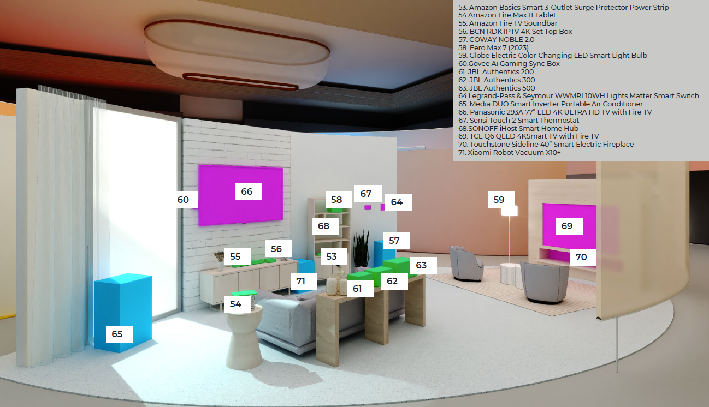

Living Room
=====

Make the time you spend in your living room easier by allowing Alexa to help you throughout your day. In the morning when you leave for work, the “I’m leaving” routine starts the Xiaomi Robot Vacuum. All of the lights in the house including your Globe Electric Color-Changing Smart Bulbs turn off. The Coway Noble runs automatically if the air quality gets poor. In case you forget, your Sensi Smart Thermostat is set to your preferred temperature when Alexa knows you are away from home. After dinner, you settle down in front of the Touchstone Smart Electric Fireplace to set the mood for movie night as your favorite, family-friendly film on the Panasonic 4K Ultra HD TV with Fire TV, while the Midea DUO Smart Portable Air Conditioner runs in the background. All devices seamlessly connect to the eero Max 7 with Wi-Fi 7 technology too, so you can enjoy greater capacity, less latency, and more efficiency on your network.

|

|

Amazon Basics 3-Outlet Surge Protector Power Strip
-----

🟦 `Product Detail Page <https://www.amazon.com/Amazon-Basics-Smart-3-Outlet-Protector/dp/B095XBHVF2>`_

**Details**

The Amazon Basics Smart Power Strip is your stress-free gateway to a smart home. With Alexa compatibility, this surge-protected power strip offers easy voice control, ideal for non-experts. Control lights, fans, and appliances from anywhere, individually or grouped, through the Alexa app—no smart home hub required. Certified for Humans, it ensures a struggle-free setup. Enjoy the convenience of three controllable outlets and two USB ports. Safeguard your devices with built-in surge protection. Upgrade effortlessly to smart living with this user-friendly and Alexa-enabled power strip.

* SMART UPGRADE: Amazon Basics Smart Power Strip works with Alexa to add voice control to your home; an easy upgrade from your traditional power strip
* CERTIFIED FOR HUMANS: Struggle-free, tinker-free, stress-free. Smart home made easy for non-experts
* CONTROL FROM ANYWHERE: Schedule lights, fans, and appliances to turn on and off automatically, or control them remotely when you’re away
* SIMPLE TO SET UP AND USE: Plug in the power strip, open the Alexa app, and get started in minutes
* INDIVIDUAL CONTROL OR GROUPING: Includes 3 independently controllable outlets plus 2 always-on USB ports. Control each outlet individually by voice or remotely; or create groups in the Alexa app to combine devices together
* NO SMART HOME HUB REQUIRED: Set up routines and schedules through the Alexa app; 2.4GHz Wi-Fi required; works exclusively with Alexa
* SURGE PROTECTION: Keeps devices safe from potentially damaging power surges
|
|
|

Amazon Fire Max 11 Tablet
-----

🟦 `Product Detail Page <https://www.amazon.com/Introducing-Amazon-powerful-octa-core-processor/dp/B0B1VQ1ZQY>`_

**Details**

The Amazon Fire HD 11 Max tablet brings entertainment to life with a vibrant 11-inch display, Dolby Atmos speakers, and a powerful octa-core processor. Enjoy hands-free control through Alexa, seamlessly integrating with your smart home and offering voice commands for tasks, content, and more. With 12 MP front and rear cameras, USB-C fast charging, and up to 12 hours of battery life, the Fire HD 11 Max is a versatile tablet for work and play, providing an immersive experience and easy accessibility.

* BIGGER, BRILLIANT, BEAUTIFUL: Vivid 11“ screen with 2.4 million pixels (2000 x 1200 resolution) lets you see every detail of your favorite movies, TV shows, and games. Certified for low blue light.
* MAX PERFORMANCE: Built with a powerful octa-core processor, 4 GB memory, and Wi-Fi 6 for fast streaming, responsive gaming, and quick multitasking.
* THIN AND LIGHT: Sleek aluminum design is also durable. It has strengthened glass and is 3 times as durable as the iPad 10.9-inch (10th generation) as measured in tumble tests.
* ALL-DAY ENTERTAINMENT: With 14-hour battery life, maximize your downtime for reading, browsing the web, watching videos, and listening to music at home and on-the-go. Save your favorites with 64 or 128 GB storage, and expand to up to 1 TB with micro-SD card (sold separately).
* VERSATILE FOR WORK AND PLAY: Optional Fire Max 11 Keyboard Case and/or Made for Amazon Stylus Pen (sold separately). Try Microsoft 365 Personal for 3 months (auto renews for $6.99/month after free trial, eligibility and terms apply).
* CLEAR COMMUNICATION: The 8 MP camera makes for clear calls to friends and family on Zoom.
* GREAT FOR FAMILIES: Amazon Kids offers easy-to-use parental controls on Fire tablets. Subscribe to Amazon Kids+ for access to thousands of books, popular apps and games, videos, songs, Audible books, and more (subscription rates apply).
* SMART-HOME READY: Ask Alexa for help with anything from recipes to jokes, or use the smart home dashboard to control your connected devices at a touch. Show Mode turns Fire Max 11 into a smart display.
* If you are blind, have low vision, or have trouble reading, the VoiceView screen reader can help you find your way around your Fire tablet by reading text aloud. Voice View on Fire tablet also supports reading, typing, and basic navigation in braille with compatible braille displays.
    
    You can now control your Fire HD 10 tablet (2023 release) by just using your voice. Voice Access uses speech recognition to perform actions on the device like “Go Back,” “Scroll Down,” and “Go Home.” Available in English only at this time.
    
    Switch Access for Fire tablets offers compatibility with Bluetooth devices as “switches” to interact with your Fire tablet (Fire -OS 6 and higher) with the touch of a button, blink of an eye, or puff on a sip-and-puff.
    
    Use Speak Selection on Fire tablet to select specific items, or entire content of the screen, to be read aloud.
    
    Fire Max 11 ONLY: Our first foray in supporting customers with mobility or speech disabilities to use Alexa with their eyes. Instead of using voice or touch, Eye Gaze on Alexa allows customers to gaze at their tablet to perform preset Alexa actions, like playing music and shows, controlling their home environment, and communicating with loved ones—entirely hands and voice-free.
|
|
|

Amazon Fire TV Soundbar
-----

🟦 `Product Detail Page <https://www.amazon.com/Introducing-Amazon-Soundbar-speaker-Virtual/dp/B0C4BZ28PG>`_

**Details**

Bold sound. Easy setup. Compact design. Fire TV Soundbar enhances movies, shows, sports, and games with immersive sound, crisper dialog, and enhanced bass—all in a compact design. DTS Virtual:X and Dolby Audio heighten your entertainment with spatial audio. Just plug in, connect to your TV, and you're up and running with room-filling sound that's always in sync.

* Amp up your audio: Fire TV Soundbar enhances TV audio with dual speakers for fuller sound, clearer dialogue, and deeper bass—all in a compact design.
* Immersive sound: Enjoy a three-dimensional virtual surround sound experience with DTS Virtual:X and more detail with Dolby Audio.
* Easy setup: Just plug in the included HDMI cable to the HDMI eARC/ARC port on your TV to instantly enjoy audio that's always in sync.
* Compact design: With a length of 24“ and a height of just 2.5", Fire TV Soundbar fits most entertainment consoles and TV stands.
* Stream audio with Bluetooth: Connect your phone or tablet via Bluetooth to fill the room with your favorite music.
* Fire TV Ready: Designed and tested to work seamlessly with Fire TV, for control of your TV and audio with one remote.
* Compatible with smart TVs: Fire TV Soundbar works with smart TVs, and TVs connected to streaming media players.
* Designed for sustainability: This device is made from 18% recycled materials (power adapter and cable not included).
|
|
|

Bheem TV Ultra 4K Alexa Built-in Set Top Box
-----

**Details**

Experience entertainment like never before with the Bheem TV Ultra 4K Alexa Built-in Set Top Box. Effortlessly access your favorite streaming services, apps, and channels, all with the convenience of Alexa voice control. The sleek design and advanced display technologies make this Set Top Box a centerpiece of entertainment, bringing a theater-like experience to your home with the power of RDK and Alexa.

* OTT Apps and Streaming Channels: access OTT Apps & TV Channels on the same box
* Utra 4K Streaming Player: Enjoy seamless streaming experience no matter what with Ultra 4K streaming player
* 3 Step Simple Setup to Use the device: 1)Attach Bheem TV Ultra 4K Alexa Built-in Set Top Box to TV 2)Connect to Internet & 3) Start Streaming
* Alexa Built in: Take control with the enhanced voice remote and access all of Alexa’s top use cases such as music control, smart home, Household organization in addition to Content control
|
|
|

Coway NOBLE 2.0
-----

🟦 `Product Detail Page <https://coway-usa.com/en/aircare/Premium-Air>`_

**Details**

Improve your air, elevate your space with the Coway Noble 2.0 Air Purifier. With its modern and luxurious design inspired by architectural forms and its 4D Fiter system, deliver 360 degrees of purification to every corner of your room. Control various air circulation modes with the Air Pop-up Panel or with your voice with Alexa, including Pet Mode which removes fur, dust and allergens from the floor and air.

* Various air circulation modes with the Air Pop-Up Panel: Four-sided air intake and various circulation modes deliver clean air to ever corner of the room.
* Modern and luxurious design inspired by architectural forms
* 4D Filter System for 360 degree purification: 4D pre-filter, Indoor Fume Filter + Double-Deodorization Filter, Deodorization Filter, 4D HEPA Filter
* Pet Mode to remove fur, dust, and allergens from the floor and air: Unique circulation mode to effectively lift contaminants from the floor throughout the room and remove them from the air
|
|
|

eero Max 7
-----

🟦 `Product Detail Page <https://www.amazon.com/dp/B09HJJN7MS/>`_

**Details**

eero Max 7 delivers a whole new level of fast, with wired speeds up to 9.4 Gbps and wireless speeds up to 4.3 Gbps. Built with Qualcomm Technologies’ leading Wi-Fi 7 Networking Pro Platform and our patented TrueMesh, eero Max 7 can provide more than twice the speed of Wi-Fi 6, greater capacity, less latency, and more efficiency on your network—making it ideal for high performance gaming. Setup is a breeze with the eero app and it works as a smart home hub. A single eero Max 7 covers 2,500 sq. ft. and connects 200+ devices. Get ready for an entirely new class of eero, built without compromise.

* THE SPEED OF EERO MAX 7: With two 10 Gigabit Ethernet ports, you can enjoy wired speeds up to 9.4 Gbps, wireless speeds up to 4.3 Gbps, and multi-gigabit backhaul speeds—making your network seriously fast.
* THE POWER OF WI-FI 7 TECHNOLOGY: Wi-Fi 7 technology can provide more than twice the speed of Wi-Fi 6, so you can enjoy greater capacity, less latency, and more efficiency on your network.
* TRUEMESH RELIABILITY: Our patented TrueMesh network intelligence dynamically finds the ideal path for data transfer, limiting interference and helping ensure fast, reliable internet.
* LEVEL UP YOUR GAME: eero Max 7 helps deliver high performance gaming experiences, ideal for AR, VR, and cloud applications that require high throughput and low latency.
* ADVANCED DIGITAL SECURITY: An optional subscription to eero Plus protects your data, helping to keep your family’s personal information, connected devices, and network protected from online threats.
* BUILT FOR SMART HOMES: eero Max 7 works as a smart home hub so you can connect Thread devices, as well as Matter and Zigbee devices (as a controller only).
* MORE COVERAGE, MORE DEVICES: Provides up to 2,500 sq. ft. of mesh wifi coverage and connects 200+ devices.
* SET UP IN MINUTES: The eero app guides you through setup and allows you to manage your network from anywhere.
* DESIGNED FOR SUSTAINABILITY: This device is made from 61% recycled materials.
|
|
|

Globe Electric Color-Changing LED Smart Light Bulb
-----

🟦 `Product Detail Page <https://www.amazon.com/Globe-Electric-50589-Multicolor-Activated/dp/B0B18YYJZK>`_

**Details**

Transform your space with the Globe Electric Color-Changing LED Smart Light Bulb. This innovative bulb brings vibrant hues to your surroundings, allowing you to create the perfect ambiance for any occasion. With Alexa, effortlessly control the lighting with voice commands. The energy-efficient design and easy integration into your smart home ecosystem make this smart bulb a dynamic and customizable lighting solution. Elevate your environment with a spectrum of colors and the convenience of smart home connectivity.

* ALEXA EXCLUSIVE: Easily control your Smart Bulbs using your voice or via the Alexa app from your smartphone or tablet anywhere, anytime with a frustration-free set-up. Note: this Smart Bulb works exclusively with Amazon Alexa, not with Google Assistant, Apple HomeKit, Smart Things, Globe Suite, and has to be set up with 2.4GHz Wi-Fi only.
* SIMPLE TO SET UP WITH ALEXA: Install the Smart Bulb, open the Alexa app, and get started in minutes as you get notified “First bulb found”. Otherwise, you can add the Smart Bulb directly from Alexa app. No hubs or 3rd party apps or skills required. For zero touch set up experience, check “Link device to your Amazon account to simplify setup” during checkout and get started with your Smart Bulb in no time. Note: This Globe Electric Smart Bulb works exclusively with Alexa to be set up with 2.4GHz Wi-Fi only.
* VOICE CONTROL: Using your Alexa Echo, not Google Assistant, Apple HomeKit, Smart Things, or Globe Suite, you can control your smart light bulbs via voice commands to turn your smart bulbs on/off, create suitable mood scenes, adjust brightness and more, e.g. Switch on the Alexa light bulb before getting out of bed or dim the smart lights from the couch to watch a movie.
* SIMPLIFY DAILY ROUTINES: Using Alexa App Routines, automate your daily routine to have lights turn on or off at the same time everyday or to look like you're home when you're not. Adjust your lights individually or group multiple items together to synchronize lighting for a whole room, and control them anytime, anywhere.
* TRANSFORM YOUR SPACE: Create memorable moments out of your daily routines by customizing your lights. Energize, read, concentrate, relax or create a fun party atmosphere with color with Globe Electric's Amazon Alexa Smart LED Light Bulbs. Have the perfect light for every moment in your day.
|
|
|

Govee AI Gaming Sync Box
-----

🟦 `Product Detail Page <https://www.amazon.com/Govee-HDMI2-0-Backlight-Compatible-Assistant/dp/B0C5XLS7F4>`_

**Details**

The Govee AI Gaming Sync Box enhances your gaming experience with dynamic, ambient lighting that synchronizes with on-screen action. This innovative device supports Alexa integration, allowing hands-free control and customization. With its responsive lighting effects, customizable scenes, and compatibility with various gaming platforms, the Govee AI Gaming Sync Box immerses you in stunning visuals. Elevate your gaming setup with personalized lighting that reacts in real-time, creating a captivating and dynamic atmosphere for an unparalleled gaming adventure.

* Responds to Specific Game Actions: Govee's CogniGlow algorithm recognizes your in-game actions, displaying specialized gaming lighting effects. AI effects work with LOL, Apex, OW2, Fortnite, COD, PUBG, Valorant, and CS: GO. More titles coming soon. (Note:The Sync Box is unable to read TV apps data.)
* 99% Color-matching Accuracy: Reflects colors and movements of on-screen content with ultra-low latency while avoiding the influence of ambient lighting. This includes not only console games but movies, TV shows, sporting events, and more.
* Tip for Improving Viewing Experience: If the lights are dim in Video Mode, please connect the device to Wi-Fi and wait for 4 hours. The app will remind you to upgrade the firmware. Confirm your device firmware is upgraded to V1.00.26.12.
* Govee DreamView 360° Syncing: With the Govee DreamView smart syncing system, you can mirror your AI Gaming Sync Box lighting across other Govee gaming lights, wall lights, strips, panels, lamps, and bulbs for an immersive 360° lighting experience.
* Multi-Device Support: Connect up to 3 devices with the Govee AI Gaming Sync Box. Compatible with PlayStation, Xbox, and Switch. It also works with cable and streaming boxes like Amazon Fire TV, Apple TV, and more. Easily switch between devices for super-smooth cable management.
* 4K Resolution Support: Play your games up to 240Hz in 1080p, plus 144Hz 2K and 60Hz 4K. Govee HDMI gaming lights with sync box support HDR10.
|
|
|

JBL Authentics 200
-----

🟦 `Product Detail Page <https://www.amazon.com/JBL-Authentics-200-Bluetooth-Assistants/dp/B0CCK25S7Z>`_

**Details**

Retro meets cutting-edge performance. With its Quadrex grille, custom leather-like enclosure, and premium aluminum frame, the stunning retro design of the JBL Authentics 200 makes a statement in any room. And so does its superb sound, with amazing clarity and deep bass. Plus, with Google Assistant and Amazon Alexa available simultaneously, you can get hands-free help at home.

* Superb sound and performance: Fill any room in your house with stereo sound. A pair of 25mm tweeters bring out the **Details** in your music, while the full-range 5 inch woofer and downfiring 6 inch passive radiator deliver deep bass. These top-grade components ensure you'll get the perfect audio balance, no matter what kind of music you're listening to.
* Inspired by retro design: The JBL Authentics 200 is inspired by classic JBL heritage designs for a look that complements any room and fills any space—big or small—with superior JBL sound. And the speaker's premium aluminum frame, custom leather-like enclosure, and reimagined Quadrex grille really show the attention we paid to each visual detail, right down to the JBL signature pattern surrounding the down firing passive radiator.
* Music streaming services via built-in Wi-Fi: Experience everything from podcasts to internet radio in stunning high definition. Or stream music through AirPlay, Alexa Multi-Room Music (MRM), Chromecast built-in, and Spotify Connect and leave the room or take a call without the music being interrupted. The Wi-Fi connection ensures your speaker gets automatic software and feature updates.
* Voice assistants, simultaneously on one device: Google Assistant and Amazon Alexa are available simultaneously. This gives customers the most freedom and convenience to control more smart home devices, play from more music streaming services, and get the most hands-free help from either voice assistant at any given time.
* Seamless Bluetooth pairing: Seamlessly share playlists by pairing the JBL Authentics 200 with any Bluetooth devices.
|
|
|

JBL Authentics 300
-----

🟦 `Product Detail Page <https://www.amazon.com/JBL-Authentics-300-Streaming-Built/dp/B0CCK2TFQB>`_

**Details**

Retro style with superior sound. Enjoy retro style and amazing audio performance with the JBL Authentics 300 speaker. Take your music with you thanks to the convenient leather covered metal handle and built-in rechargeable battery. Its retro '70s-inspired design makes a bold statement—anywhere—along with its wide soundstage, crystal-clear highs, and deep bass. Plus, with Google Assistant and Amazon Alexa available simultaneously, you can get hands-free help at home.

* Superb sound and performance: Fill any room in your house with stereo sound. A pair of 25mm tweeters bring out the **Details** in your music, while the full-range 5.25-inch woofer and down-firing 6.5-inch passive radiator deliver deep bass. These top-grade components ensure you'll get the perfect audio balance, no matter what kind of music you're listening to.
* Inspired by retro design: The JBL Authentics 300 delivers iconic style inspired by classic JBL retro designs, in a portable home speaker that looks great in any decor. It will easily fill any space, big or small, with superior JBL sound. And the speaker's convenient cast-aluminum handle, custom leather-like enclosure, and reimagined Quadrex grille really show the attention we paid to each visual detail, right down to the special JBL signature pattern on the down-firing passive radiator.
* Built-in battery: Keep the music going with 8 hours of playtime from a built-in battery and an integrated carrying handle that makes it easy to take your audio anywhere.
* Music streaming services via built-in Wi-Fi: Experience everything from podcasts to internet radio in stunning high definition. Or stream music through AirPlay, Alexa Multi-Room Music (MRM), Chromecast built-in, and Spotify Connect and leave the room or take a call without the music being interrupted. The Wi-Fi connection ensures your speaker gets automatic software and feature updates.
* Voice assistants, simultaneously on one device: Google Assistant and Amazon Alexa are available simultaneously. This gives customers the most freedom and convenience to control more smart home devices, play from more music streaming services, and get the most hands-free help from either voice assistant at any given time.
|
|
|

JBL Authentics 500
-----

🟦 `Product Detail Page <https://www.amazon.com/dp/B0CCK36RSY>`_

**Details**

Fill any room with cutting-edge sound and striking retro style with the JBL Authentics 500. From its Quadrex grille to its custom leather-like enclosure, the speaker was inspired by JBL's iconic 1970s designs, updated for the 21st century with the latest sound and control technologies. Immerse yourself in high-definition lifelike sound with Dolby Atmos Music thanks to the Authentics 500's aluminum tweeters and patented SlipStream bass port. With Google Assistance and Amazon Alexa available simultaneously, you can play your favorite music, control your smart home devices, and more, hands-free, using just your voice.

* Superb sound and performance with Dolby Atmos Music: 270 watts of 3.1 channel sound, with virtual Dolby Atmos create a lifelike musical experience that makes you feel like you're hearing your music live—right from the front row. Three 2.5mm tweeters and three 2.75" midrange woofers provide so much clarity that every detail of your favorite song sounds brand new, while a 6.5" down firing subwoofer and the patented SlipStream bass port extend the low end to a new level of bass that you can feel. Dolby Atmos Music content is available from compatible streaming services in the JBL One app.
* Inspired by retro design: The JBL Authentics 500 delivers the iconic style inspired by classic JBL heritage designs, for a look that complements any room, easily filling even the largest space with superior JBL sound. And the speaker's premium aluminum frame, custom leather-like enclosure, and reimagined Quadrex grille really show the attention we paid to each visual detail, right down to the special JBL signature pattern surrounding the downfiring woofer.
* Music streaming services via built-in Wi-Fi: Experience everything from podcasts to internet radio in stunning high definition. Or stream music through AirPlay, Alexa Multi-Room Music (MRM), Chromecast built-in, and Spotify Connect and leave the room or take a call without the music being interrupted. The Wi-Fi connection ensures your speaker gets automatic software and feature updates.
* Voice assistants, simultaneously on one device: Google Assistant and Amazon Alexa are available simultaneously. This gives customers the most freedom and convenience to control more smart home devices, play from more music streaming services, and get the most hands-free help from either voice assistant at any given time.
* Seamless Bluetooth pairing: Seamlessly share playlists by pairing the JBL Authentics 500 with any Bluetooth devices.
|
|
|

Legrand - Pass & Seymour Matter Smart Switch (WWMRL10WH)
-----

**Details**

Elevate your smart home experience with the Legrand-Pass & Seymour WWMRL10WH Lights Matter Smart Switch. Easily connect this device to your smart home using Matter. With Alexa enjoy hands-free control of your lights using voice commands. Its sleek design and intuitive features make it a stylish and functional addition to your home. Simplify lighting control, enhance convenience, and embrace the future of smart home technology with this Matter Smart Switch.

* Matter Built-In: Each device comes with Matter built-in, allowing for greater interoperability and compatibility with the latest smart home platforms - including Amazon Alexa, Apple HomeKit, Google Home, and Samsung SmartThings. No separate manufacturer application is needed and setup is handled directly with the smart home platforms.
* Voice and Smartphone Control: Easily control
* Fast Setup: With the Matter standard, devices can be quickly onboarded with QR codes located directly on the device. Legrand developed these devices to use Amazon's Alexa Connect Kit SDK for Matter that allows purchases through Amazon to leverage Amazon's — Frustration Free Setup process - working right out of the box with your Matter-certified Amazon Echo.
* Matches Décor: As part of the radiant(R) collection from Legrand, each device is designed to complement any space while providing smarter control. Easily blend in with other, non-connected devices with a full range of wiring devices from the rest of the radiant collection.
* Wi-Fi Connected: Each device is designed to connect directly to your Wi-Fi network for smart control. With Matter, devices will continue to work even when your internet connection is lost. Gone are the days of voice assistant telling you it can't turn off your lights when you lose connection to the internet.
|
|
|

Midea DUO Smart Inverter Portable Air Conditioner
-----

🟦 `Product Detail Page <https://www.amazon.com/Midea-Conditioner-Dehumidifier-Fan-Cools-Assistant/dp/B091CHK173>`_

**Details**

Beat the heat with the Midea DUO Smart Inverter Portable Air Conditioner. Experience personalized comfort with dual inverter technology, allowing precise temperature control and energy efficiency. With its compact design, this portable AC ensures cooling wherever you need it. Seamlessly integrate it into your smart home with Alexa, enabling voice control for ultimate convenience. Stay cool, save energy, and enjoy a comfortable environment with Midea DUO's cutting-edge features and smart home integration.

* INNOVATIVE DUO HOSE DESIGN: Midea's industry-first dual hose-in-hose design enables the unit to intake and exhaust air outdoors. The dual hose-in-hose design forms balanced air circulation indoors and prevents hot outside air from seeping in through gaps.wattage: 1200 watts..Control Type: Electronic. Refrigerant: R-32
* INVERTER TECHNOLOGY: Engineered with the variable-speed inverter technology, Midea Duo Inverter portable AC cools more with considerably less electricity than traditional portable units. It saves more than 40% energy compared to U.S. federal standard
* MORE THAN 2X FASTER AND STRONGER COOLING: Empowerd by the Duo hose design and an optimized air duct system, Midea Duo can lock and maximize cooling indoors. Now you can enjoy a 2X faster and stronger whole-room cooling experience like never before
* SMART CONTROL: This unit comes Wi-Fi enabled with app connectivity and voice control options. Control from anywhere with the MSmartHome App for iOS and Android or by voice with Alexa and Google Assistant devices
* 42dB ULTRA-QUIET OPERATION: The sound level of the Midea Duo is as low as 42dB, almost as quiet as a library! Install in the bedroom or living room and enjoy sleep, a good book, or your favorite show without the disturbing noise of a traditional AC
|
|
|

MultiOn
-----

🟦 `Product Detail Page <https://www.multion.ai/>`_

**Details**

MultiOn created an AI that handles tasks in the background of any digital experience. When you use a site or app built with MultiOn, the experience is remarkably streamlined. That’s because their AI is handling tasks that don’t require your attention, which means less hands-on work for you. When we don’t have to focus on mundane or overly complex tasks, a weight is lifted. We can be more intentional with our time, shifting our focus to activities and interactions that actually interest us, fulfill us and expand what we’re capable of.
|
|
|

Panasonic 77“ LED 4K Ultra HD TV with Fire TV (Z93A)
-----

**Details**

The Panasonic Z93A LED 4K Ultra HD TV with Fire TV built in and access to Alexa, offers the company’s trademark high-quality picture and sound, paired with the content-forward experience of Fire TV. You can enjoy a world of entertainment, while the included Voice Remote with Alexa lets you use your voice to easily change channels, launch apps, search for titles, play music, and even control smart home devices.

* Z93A is Panasonic’s core 4K LED TV range, offering high-quality picture and sound.
* HDR Cinema Display delivers a wide range of colours for a more natural picture, with LED backlighting for consistent and high brightness.
* SOUND AND VISION: The Z93A’s HDR Cinema Display panel delivers a wide range of colours for a more natural image, with LED backlighting for consistent and high brightness. Panasonic's original HCX Processor and Filmmaker Mode make picture true to the filmmaker's vision. Meanwhile, support for the latest HDR technologies – HDR10+ and Dolby Vision – allows for dynamic colour and contrast. Of course, a great picture is nothing without impactful audio. For immersive sound that puts you right into the action, the Z93A features Dolby Atmos support that creates an enriched surround experience. Surround Sound also delivers truly dynamic sound that transports you from your sofa to the heart of the action, whether you’re watching a film or engrossed in a game.
* SERIOUS ABOUT GAMING: With the Z93A, switching from TV to gaming couldn’t be simpler, thanks to Panasonic’s Game Mode. Game Mode instantly reduces input lag and latency so what you see on screen matches your commands exactly, giving you a smoother gameplay experience that faithfully reproduces the vision of game creators. In combination with detecting consoles, the TV automatically switches to lowest input lag mode thanks to the ALLM feature.
* EMBRACING FIRE TV: Panasonic introduces Fire TV built into its TV range with the Z93A, offering an elevated, simplified user experience. With Fire TV built in and access to Alexa, you can enjoy a world of entertainment from live over-the-air content and streaming apps and services such as Prime Video, Netflix, and Disney+ (subscriptions may be required). The included Voice Remote with Alexa lets you use your voice to easily change channels, launch apps, search for titles, play music, and even control compatible smart home devices.
* A STREAMLINED EXPERIENCE: For an unparalleled streamlined user experience Z93A comes with Panasonic’s proprietary remote control. With the design being improved consistently over the years without losing sight of the needs of TV viewers, the remote comes with all the necessary buttons for direct access to all the Z93A's features with a simple press. Unique to Panasonic TVs are the My App button, which provides a convenient shortcut to a preferred app or FOS with one click, and the Picture Mode button, which allows users to directly switch Picture Modes to suit their content. Meanwhile, improved channel management functions will allow users to easily customise channel lists, select favourites, and more, and an upgraded EPG will make it simple to filter content by genre or input signal. Finally, access to the HbbTV red button applications of each terrestrial channel delivers a simple gateway to catch-up services, with the Z93A bridging the gap between connected TV apps and traditional linear viewing.
|
|
|

Sensi Touch 2 Smart Thermostat
-----

🟦 `Product Detail Page <https://www.amazon.com/Thermostat-Touchscreen-Programmable-Certified-ST76/dp/B0BKH83KF9>`_

**Details**

Upgrade to the Energy Star certified Sensi Touch 2 Smart Thermostat to save energy while keeping you comfortable. Save about 23% on HVAC energy with features like flexible scheduling, remote access and usage reports. Sensi is Works With Alexa certified so Alexa sets up easily and works seamlessly. Many utilities offer rebates for Sensi Touch 2 to reduce the initial cost. Sensi thermostats include heating and cooling system monitoring to detect conditions that could adversely affect your family, pets or property. Enjoy easy DIY installation with the user-friendly design and app guidance for a hassle-free setup.

* Energy savings: Save about 23% on HVAC energy through features like flexible scheduling, remote access and usage reports.
* Works With Alexa: Sensi thermostats are Works With Alexa certified and support advanced features like the Alexa energy dashboard and Dash replenishment for HVAC filters.
* Smart Alerts: Sensi thermostats include heating and cooling system monitoring to detect conditions that could adversely affect your family, pets or property. 
* Room Sensors: Compatible with Sensi Room Sensors to balance temperatures throughout your home
* Easy DIY installation: Designed to be installed quickly with less need for patching or painting thanks to the traditional thermostat design. The easy-to-use app will walk you through the step-by-step process quickly. 
* HVAC Expertise baked in: More than 100-years of experience with HVAC systems went into the development of Sensi
* Upgrade your home's energy efficiency with the Energy Star certified Sensi Touch 2 Smart Thermostat, designed to save you energy while keeping you comfortable. Enjoy savings of about 23% on HVAC energy through advanced features like flexible scheduling, remote access, and detailed system usage reports. 
* Sensi thermostats are Works With Alexa certified and support advanced features like the Alexa energy dashboard and Dash replenishment for HVAC filters. Take advantage of utility rebates provided by your energy provider to reduce the initial cost of the thermostat, making energy efficiency even more accessible.
* Sensi thermostats include heating and cooling system monitoring to detect critical conditions that could adversely affect your family, pets or property. Sensi will send alerts for high temperature, high humidity, low temperature, loss of heating and loss of cooling. You can also set up reminders in the Sensi app to alert you when it’s time to change your filter or schedule service with your HVAC contractor.
* Installing the Sensi Touch 2 is a breeze with the Sensi app walking you through each step, enabling an easy DIY installation. With Sensi’s traditional thermostat design, you will have less patching or painting after the install. 
|
|
|

SONOFF iHost Smart Home Hub
-----

🟦 `Product Detail Page <https://www.amazon.com/SONOFF-Central-Automation-Compatibility-Customization/dp/B0CCNDYH8P>`_

**Details**

The SONOFF iHost Smart Home Hub is a versatile control center for intelligent living. Seamlessly integrating with Alexa, it empowers voice commands for a wide range of smart devices. This hub supports Wi-Fi and Zigbee protocols, connecting various SONOFF devices and offering centralized control. With its intuitive touch screen and user-friendly interface, managing your smart home has never been easier. Enjoy automation, energy efficiency, and a connected lifestyle with the SONOFF iHost Smart Home Hub.

* Matter Supported, New SKUSupport for a Wide Range of Device Types Such as Smart Plug/Sensors/Switches/Smart Lights.
* Local Control Center: The iHost Smart Home Hub serves as your local control center, elevating your home automation experience to be faster, more reliable, and more secure.
* Local Automation: iHost supports settings local security modes and smart scenes. With software updates, it gradually unlocks more customizable capabilities.
* Local Data Storage & Manage: iHost is dedicated to delivering a swift and seamless home automation experience. With local data storage and management, rest assured your information remains local and private, safeguarding your data security.
* Strong Compatibility: Fully compatible with Zigbee standard protocol devices and Wi-Fi LAN devices. Manage up to 128 sub-devices and, with a Zigbee router, extend the Zigbee network range for whole-home control. Through the eWeLink Smart Home Add-on, you can integrate Wi-Fi devices that support LAN control from SONOFF.
* Expandable Add-Ons: Accommodate a range of add-ons to unlock more possibilities, ensuring all your needs are met.
|
|
|

Touchstone Sideline 40“ Smart Electric Fireplace
-----

🟦 `Product Detail Page <https://www.amazon.com/Touchstone-80006-Recessed-Electric-Fireplace/dp/B00LI6A7J4>`_

**Details**

Enhance your space with the Touchstone Sideline 40 Recessed Electric Fireplace. This stylish addition brings warmth and ambiance with its realistic flame effects and customizable heat settings. The recessed design adds a modern touch, seamlessly integrating into your decor. With Alexa compatibility, you can effortlessly control the fireplace with your voice to create a cozy atmosphere in any room, making it the perfect focal point for your home.

* APPEARANCE: The Forte electric fireplace is designed for recessed in-wall mounting. Creating a cozy atmosphere of a traditional fireplace, this electronic fireplace has realistic flames with a real fire look. The Forte’s 5 flame settings radiate a soft ember glow up to an intense blaze. Forte gives you the total package. Control the heat and flame with the remote control. Designed to use one log or crystal, if you prefer you can mix both safely.
* INSTALLATION: This Forte installs simply and can safely be attached to framing studs. The sides & back of the unit remain cool to the touch with the heat feature on. Recommended minimum of 8” of space between the top of the fireplace and your TV, mantel, picture ceiling. The Forte can be installed in existing fireplace openings safely. Consult with a licensed professional to ensure your unused gas lines and vents are secured properly. The Forte fireplace is ventless.
* OPERATION: The Forte's heater will take the edge off a cool room or basement, and it can be run with no heat (just flames) in warmer climates. The Forte comes with a 6-foot power cord for a 110-120V outlet. It is also hard-wire ready for in-wall install. The unit draws a max of 12 amps, so the fireplace can be used on a 15-amp circuit. A 20-amp circuit may be necessary, depending on the use of other electronics on that same electric circuit.
* FEATURES: The Forte features an unmatched flame. Friends will be nervous to touch realistic flame behind the glass. The Forte includes faux-fire logs & crystals to create an authentic feel, as well as an IR remote controlling flame color & intensity, the heater and shut-off timer. Front facing heater vents allow you to position the Forte just 8” under a flat screen TV. The Forte can be hardwired or plugged in to your electric source.
* WHAT YOU NEED TO KNOW: 1. We recommend 8 inches of space between your fireplace & TV. 2. The Forte pulls a max of 12 amps. 3. The fireplace includes a wall-mount bracket, if you don’t recess it. 4. You can install the Forte in an existing fireplace opening. It stays cool to the touch on the sides & back and is ventless. You can use the Forte with just the flame and no heat. 5. The heater will help to warm up a cool room but won’t replace a primary heat source.
* ALEXA/WIFI ENABLED: Control the Sideline 50 Electric Fireplace from your lounge chair using the included remote control, Alexa or Google Home device or Smart mobile app. Connect it to compatible smart home devices through the app for added convenience. Discover more about setting up the WiFi features. The wireless remote control requires AAA batteries (not included).
|
|
|

Xiaomi Robot Vacuum X10+
-----

🟦 `Product Detail Page <https://www.mi.com/global/product/xiaomi-robot-vacuum-x10-plus/>`_

**Details**

The Xiaomi Robot Vacuum X10+ combines cutting-edge technology with efficient design to revolutionize your home cleaning experience. With its navigation system, this intelligent robot vacuum seamlessly maneuvers through your living spaces, reaching every nook and cranny to ensure a thorough clean. The X10+ utilizes advanced sensors and mapping technology to create a precise map of your home. Take control of your cleaning schedule from anywhere with the Xiaomi app or Alexa. Schedule cleanings, monitor progress, and customize cleaning preferences, all from the convenience of your smartphone.

* No washing pads or emptying the dustbin by hands. Fully automatic hands-free cleaning 
* The fully automatic smart all-in-one station supports all-in-one multi-dimensional functions such as auto dust collection, pad washing, hot dry and refill. Dust collection frequency and mop cleaning modes can also be set for completely hands-free use.
* Automatic pad washing, rotary scraping for superior results: The strong water flow blasts the cleaning tray and quickly soaks the pads, rotating and scraping at high speed to remove stains before automatic spin-drying, for hands-free spotless cleaning.
* Dual air duct automatic dust collection. All waste goes into one bag to keep hands clean: With the 17000Pa power fan and dual air duct dust collection design, the dustbin is emptied in 10 seconds.The built-in 2.5L dust bag holds 60 binloads of dust.
* 2-hour quick hot air drying. For fresh pads, no need to dry: Once the pads have been washed, the minimum 2-hour hot drying time guarantees damp-free, odor-free freshness.
* Auto refill ensures consistent moisture level. Remove stubborn stains, deeply clean floors: The all-in-one station refills the robot vacuum's water tank, maintaining pad moisture.
* S-Mopping assistant. The intelligent aid for linked refill management: The new S-Mopping assistant links the all-in-one station to the robot vacuum so that when the sensor detects that the level in the clean water tank is low, water is intelligently distributed to ensure uninterrupted mopping. Actual performance may vary due to differences in objective factors such as household types and the environment.
* S-Cross AI: Advanced 3D recognition and avoidance sensor
* Al recognition +3D multidimensional obstacle avoidance. Millimeter-level sensor precision, responsive and stable obstacle avoidance. The all-new S-Cross AI Advanced 3D obstacle recognition and avoidance sensor system with millimeter-level. sensor precision supports object and environment identification, controlled cleaning motion and stable obstacle avoidance.
* Precise Al camera: Eye-like object recognition, flexible planning and cleaning. The Advanced Al camera uses an AI graphics algorithm to identify various obstacles on the floor and in rooms around the home. Flexible planning of avoidance paths and cleaning sequences, for smart home cleaning without manual intervention.
* Laser navigation, whole-room scanning Smart route planning adapts to any environment: With industry-leading laser navigation technology, 360° scanning of indoor environments, the layout of the home is quickly mapped and cleaning paths are precisely planned without risk of light or environmental interference. 3D maps can be generated using the Mi Home/Xiaomi Home app, with clear 3D imaging at the touch of a button.
* Ultrasonic carpet recognition, smart pad return for mop wash. Auto pad raise to avoid secondary contamination: Ultrasonic carpet recognition automatically raises the pads to avoid wet the carpet and turns on extra suction power while removing dust. Return for mop wash cycle will also trigger auto pad raise to avoid secondary contamination.
* Rotating dual-pad pressure mopping. Powerful stain removal leaves no trace of dirt on the floor: Dual-pad 180rpm high speed rotation, 3 water volume settings, simulated manual pressure mopping, 5 times more efficient cleaning power to rid floors of coffee spills, dried mud and other stains. Quiet action with single-mop mode for low-noise cleaning so you can enjoy undisturbed sleep.
* 4000Pa Powerful suction fan blower. Absorb ground debris and particles in a flash: Upgraded suction power with 4000Pa Powerful suction fan blower, 4 suction settings for dust, hair and crevices. Like a breath of fresh air for your floor to ensure comfortable. dust-free living.

