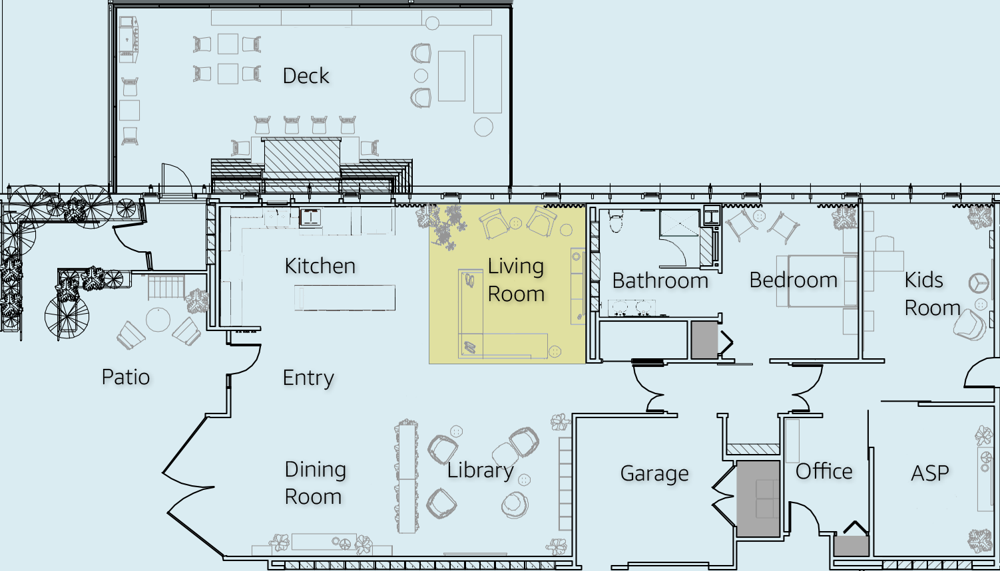

Living Room
###########

Make the time you spend in your living room easier by allowing Alexa to help you throughout your day. In the morning when you leave for work, the “I’m leaving” routine starts the Xiaomi Robot Vacuum. All of the lights in the house including your Globe Electric Color-Changing Smart Bulbs turn off. The Coway Noble runs automatically if the air quality gets poor. In case you forget, your Sensi Smart Thermostat is set to your preferred temperature when Alexa knows you are away from home. After dinner, you settle down in front of the Touchstone Smart Electric Fireplace to set the mood for movie night as your favorite, family-friendly film on the Panasonic 4K Ultra HD TV with Fire TV, while the Midea DUO Smart Portable Air Conditioner runs in the background. All devices seamlessly connect to the eero Max 7 with Wi-Fi 7 technology too, so you can enjoy greater capacity, less latency, and more efficiency on your network.

|

|

.. include:: productdetails/SonosArc.rst
