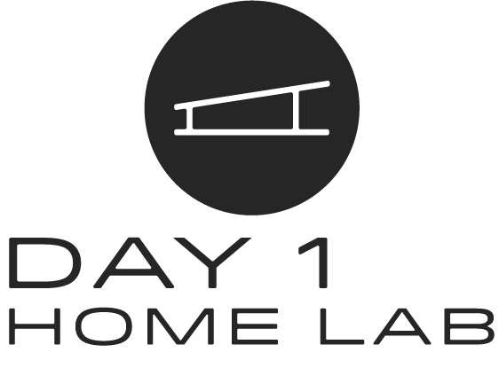
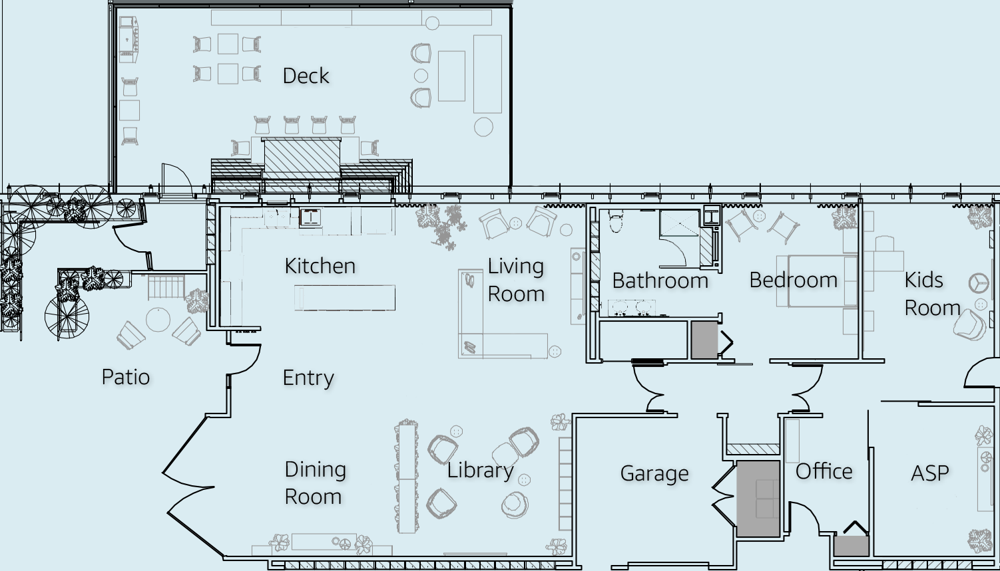

Welcome to the Day 1 Home Lab. Our exhibit this year will showcase how ambient intelligence can help make every moment of every day better. The experiences we are showcasing today illustrate how ambient intelligence developed by Amazon is being leveraged by the world's leading brands.

|

[insert intro text here]

|
|

|
|

Rooms
--------

.. toctree::
   :maxdepth: 1

   Entry
   Kitchen
   DiningRoom
   LivingRoom
   Library
   Bedroom
   Bathroom
   Garage
   Office
   KidsRoom
   ASP
   Patio
   Deck

..
  A useful guide for syntax and formatting: https://sublime-and-sphinx-guide.readthedocs.io/en/latest/index.html
  RTD Project: https://readthedocs.org/projects/d1hl-rtd/
  RTD Page: https://d1hl-rtd.readthedocs.io/
  Github: https://github.com/travisoo-amzn/D1HL-RTD/ 
