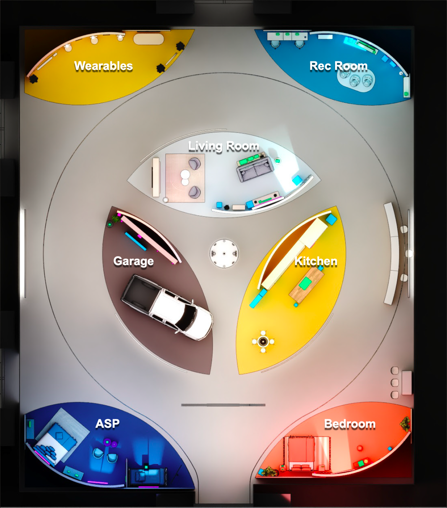

Amazon Experience Area
===================================

Welcome to the Amazon Experience Area for 2024. Our exhibit this year will showcase how ambient intelligence can help make every moment of every day better. The experiences we are showcasing today illustrate how ambient intelligence developed by Amazon is being leveraged by the world's leading brands.

Having passed half a billion devices sold, and with tens of millions of interactions every hour, Alexa has become part of the family in millions of households. We’ve always thought of Alexa as an evolving service, and we’ve been continuously improving it since the day we introduced it in 2014.

From the moment you wake up till you drift into sleep, the latest advances in ambient intelligence ensures 'Every Day Better' with Alexa. Witness the power of seamless automation with Routines, where Alexa handles your sunrise news, coffee, and blinds, all without a single word. Be more productive during your workday with products from eero and Amazon as you collaborate with colleagues around the world. Leveraging the latest innovations as you have step by step discussions with Alexa to find that perfect lunchtime recipe. Elevate family movie nights with impeccable show recommendations from FireTV. And with Ring, rest assured when you go to bed every night that your home and loved ones are secure.

Our booth is made up of different vignettes like the bedroom, the kitchen, a rec room, a garage and a hotel room. As you explore the booth, you’ll see how ambient intelligence can help make every morning calmer, every afternoon fresher and evening safer.

Ambient intelligence from Amazon, alongside the world’s leading brands, allows you the freedom to be more present with the people you love and doing what makes you feel better.

Vignettes
--------

.. toctree::
   :maxdepth: 1

   Bedroom
   Kitchen
   RecRoom
   LivingRoom
   Wearables
   Garage
   ASP
