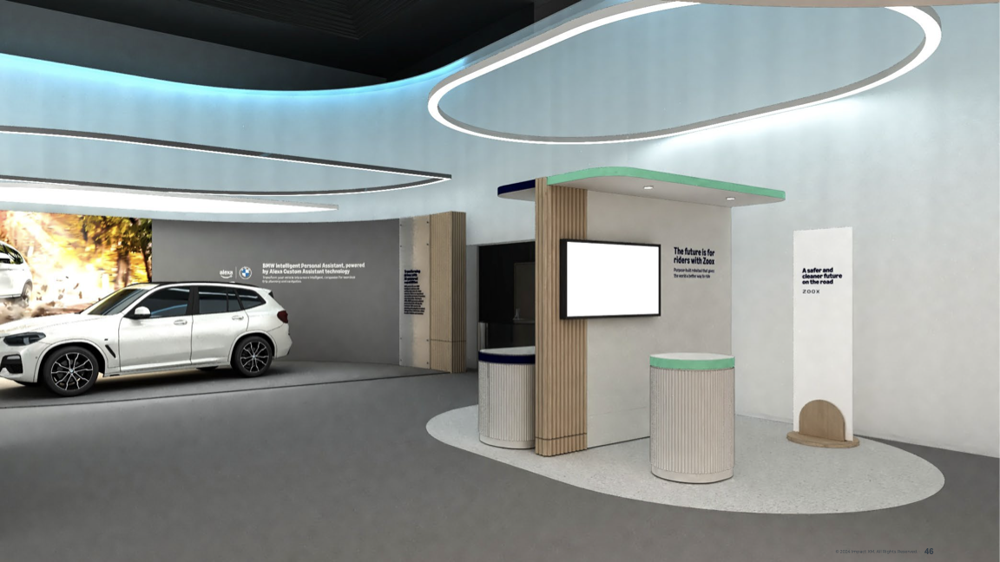

Zoox
###########

**⭐ Zoox Robotaxi ⭐**

🌐 `Webpage <https://www.zoox.com/vehicle>`_

Experience a new era of urban mobility with Zoox, a revolutionary autonomous vehicle designed to seamlessly integrate into your daily life. This innovative ride-hailing solution offers a spacious, symmetrical cabin where every seat provides equal comfort and access to personalized controls. Enjoy wireless charging and a versatile interior that adapts to your needs, whether you're working or relaxing. The compact design with four-wheel steering navigates city streets effortlessly, while over 100 safety innovations ensure peace of mind. With a powerful battery for all-day operation and advanced communication systems, Zoox interacts smoothly with its environment. From curbside pick-ups to adaptive lighting, every detail is crafted to enhance your journey, transforming everyday transportation into a seamless, enjoyable experience.

**Details**

* Reinventing personal transportation for a safer, cleaner, and more enjoyable future
*  On-demand autonomous ride-hailing that handles traffic while you relax
* Spacious, symmetrical cabin design offering equal comfort for all passengers
* Wireless phone charging and personalized ride controls via Rider Screen
* Versatile interior space for work or entertainment during your journey
*  Compact size with four-wheel steering for easy urban navigation
*  Over 100 safety innovations, including unique airbag designs
* Communicates with other road users through advanced light and sound signals
*  133 kWh battery for all-day operation without recharging
*  Seamless curbside pick-ups and drop-offs in busy city environments
*  Integrated design focusing on redundancy and reliability
*  Adaptive lighting system to indicate vehicle intentions to pedestrians and drivers

🌐 `Robotaxi in Las Vegas <https://zoox.com/journal/las-vegas/>`_

🌐 `Robotaxi in San Francisco <https://zoox.com/journal/zoox-robotaxi-in-san-francisco>`_

